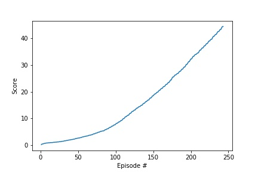

# Learning Algorithm
In this implementation we applied the DDPG algorithm [DDPG](https://arxiv.org/pdf/1509.02971.pdf) to the 20 agents version of the Reacher environment.

* [model.py](model.py) file contains neural network architecture for actor and critic models
* [ddpg_agent.py](ddpg_agent.py) file implements Agent and ReplayBuffer classes
* [checkpoint_actor.pth](checkpoint_actor.pth) file contains model checkpoint for actor neural network
* [checkpoint_critic.pth](checkpoint_critic.pth) file contains model checkpoint for critic neural network

Hyperparameters (defined in ddpg_agent.py)

* BUFFER_SIZE = int(1e6)  (replay buffer size)
* BATCH_SIZE = 64        (minibatch size)
* GAMMA = 0.99            (discount factor)
* TAU = 1e-3              (for soft update of target parameters)
* LR_ACTOR = 1e-4         (learning rate of the actor)
* LR_CRITIC = 3e-4        (learning rate of the critic)
* WEIGHT_DECAY = 0.0001        (L2 weight decay)
* UPDATE_EVERY = 10        (how many steps to take before updating target networks)

### Actor neural network

* The Actor neural network consists of a  fully connected (FC) layers (256).
* The input has 33 channels (each agent observes a state with length: 33)
* The output has same size as action size

### Critic neural network

* The Critic neural network consists of three fully connected (FC) layers (256,256,128).
* The input has 33 channels (each agent observes a state with length: 33)
* The output has same size as action size


# Plot of Rewards

DDPG took 243 episodes to solve the environment!

```
Episode 1	Average Score: 0.13
Episode 2	Average Score: 0.24
Episode 3	Average Score: 0.28
...
Episode 241	Average Score: 29.72
Episode 242	Average Score: 30.00
Episode 243	Average Score: 30.27
Enviroment solved in @ i_episode=243, w/ avg_score=30.27
```



# Improvements

* As future improvements, I would like to implement [Distributed Distributional Deterministic Policy Gradients (D4PG)](https://openreview.net/forum?id=SyZipzbCb) algorithm and compare its performance with the current impelmentation of DDPG in playing the Tennis environment.